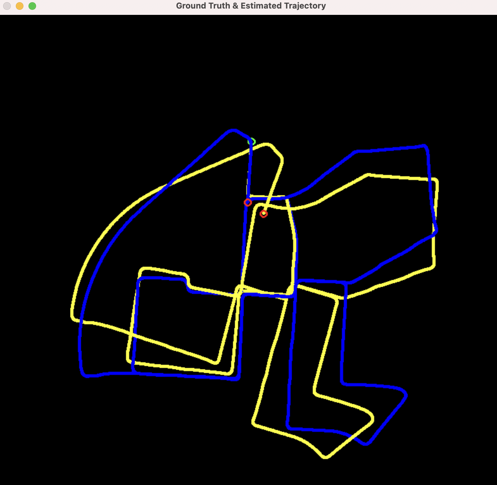

Stereo Visual Odometry run on
KITTI odometry dataset
http://www.cvlibs.net/datasets/kitti/eval_odometry.php

Estimated trajectory on sequence-00
[BLUE path:     ground truth  ]
[YELLOW path:   estimated path]

Reference:
(1) Visual Odmetry from scratch - A tutorial for beginners
https://avisingh599.github.io/vision/visual-odometry-full/

(2) First Principles of Computer Vision
https://www.youtube.com/channel/UCf0WB91t8Ky6AuYcQV0CcLw